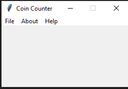

# Coin-Counter
counts the number of coins and calculates the amount

[](https://www.python.org/) [](http://perso.crans.org/besson/LICENSE.html)

# Table of contents

<!--ts-->
  * [Coin-Counter](#Coin-Counter)
  * [Table of contents](#Table_of_contents)
  * [Files](#Files)
  * [Dependencies](#Dependencies)
  * [Current Version](#Current_Version)
  * [Documentation](#Documentation)
  * [Radon](#Radon)
    * [Radon_cc](#Radon_cc)
    * [Radon_hal](#Radon_hal)
    * [Radon_mi](#Radon_mi)
    * [Radon_raw](#Radon_raw)
  * [Keybinds](#Keybinds)
  * [License](#License)
<!--ts-->


## Files

<ul>
 <li> ./doc (documentation folder) </li>
 <li> ./images (images folder) </li>
 <li> CoinRec.py(main file) </li>
</ul>


## Dependencies

To install the dependencies


<ul>
  <li> Numpy (conda install -c anaconda numpy) </li>
  <li> second way to install numpy( pip install numpy) </li>
  <li> open cv (conda install -c conda-forge opencv) </li>
  <li> second way to install open cv(pip install opencv-contrib-python-headless) </li>
</ul>


or run

```shell
pip install -r requirements.txt
```

## Current_Version


<p> </p>

## Documentation

All project documentation is located in the `./doc`  folder.


# Radon

## Radon_cc

<p> </p>

## Radon_hal

<p> </p>

## Radon_mi

<p> </p>

## Radon_raw

<p> </p>


## Keybinds

<ul>
 <li> Insert image (Ctrl + O) </li>
 <li> Exit (Alt + F4) </li>
 <li> About (Ctrl + I) </li>
 <li> Help (Ctrl + F1) </li>
</ul>


## License
[GNU GPLv3](https://choosealicense.com/licenses/gpl-3.0/)