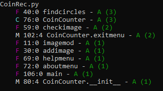
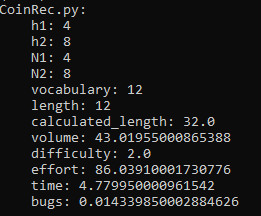
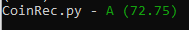
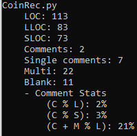

# Coin-Counter
counts the number of coins and calculates the amount

# Table of contents

<!--ts-->
  * [Coin-Counter](#Coin-Counter)
  * [Table of contents](#Table_of_contents)
  * [Files](#Files)
  * [Dependencies](#Dependencies)
  * [Current Version](#Current_Version)
  * [Documentation](#Documentation)
  * [Radon](#Radon)
    * [Radon_cc](#Radon_cc)
    * [Radon_hal](#Radon_hal)
    * [Radon_mi](#Radon_mi)
    * [Radon_raw](#Radon_raw)
  * [Keybinds](#Keybinds)
  * [License](#License)
<!--ts-->

## Files

## Dependencies

## Current_Version

## Documentation

All project documentation is located in the `./doc`  folder.

# Radon

## Radon_cc

 

## Radon_hal

 

## Radon_mi

 

## Radon_raw

 

## Keybinds

<ul>
 <li> Insert image (Ctrl + O) </li>
 <li> Exit (Alt + F4) </li>
 <li> About (Ctrl + I) </li>
 <li> Help (Ctrl + F1) </li>
</ul>

## License

[Apache-2.0](https://choosealicense.com/licenses/apache-2.0/)