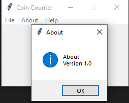
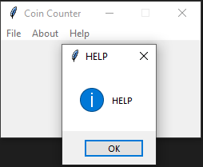

# video-and-image-frontal-face-recogntion

# File menu

## Insert image

You can insert a image using menu File --> Insert image or using Ctrl+O keybind

 

you have to insert a .jpg image or else an error message pops up

 

## Exit

You can close the app using menu File --> Exit or using Alt+F4 keybind

An informative message pops up

 

You press ok to close the app or cancel if you don't want

# About menu

You can show info about the app by using menu About --> About or using Ctrl+i keybind

An informative message pops up

 

# Help menu

You can show info about the app by using menu Help --> Help or using Alt+F1 keybind

An informative message pops up

 